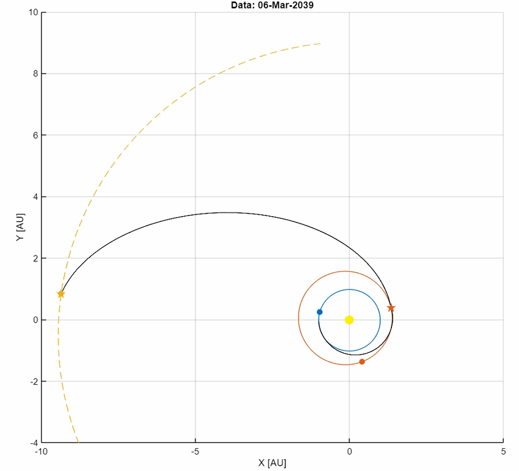
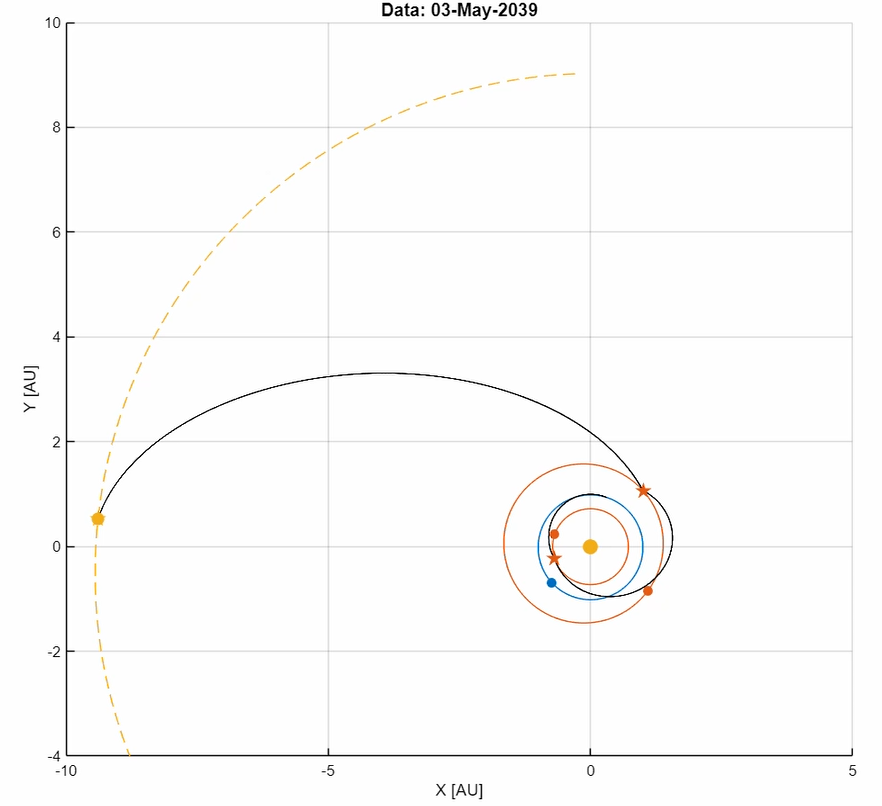

# Saturn-Moons-Interplanetary-Mission-Design-in-MATLAB
Questo repository contiene il progetto finale sviluppato per il corso di **Robotica Aerospaziale** presso l'Università di Pisa (A.A. 2025/2026).
L'obiettivo è la progettazione e l'ottimizzazione di una missione interplanetaria verso Saturno per l'osservazione delle lune **Encelado** e **Titano**, partendo da un'orbita terrestre circolare di 7500 km.

## Panoramica della Missione
La missione è stata sviluppata analizzando e confrontando due diverse architetture di volo per massimizzare l'efficienza energetica rispettando il vincolo temporale della missione di massimo 10 anni.

### Architetture Analizzate:
1.  **Missione 1 (Rotta Veloce):** Terra ➔ Marte (Fly-by) ➔ Saturno.
    * **Durata:** 5.96 anni.
    * **Delta-V Totale:** 13.43 km/s.
    * *Nota:* Richiede un impulso propulsivo elevato su Marte poiché il solo assist gravitazionale non è sufficiente.
    * 

2.  **Missione 2 (Alta Efficienza):** Terra ➔ Venere (Fly-by) ➔ Marte (Fly-by) ➔ Saturno.
    * **Durata:** 6.42 anni.
    * **Delta-V Totale:** 11.80 km/s.
    * *Vantaggio:* Riduzione significativa del consumo di propellente grazie a fly-by multipli.
    * 

## Metodologia e Strumenti
Il software è stato interamente sviluppato in **MATLAB**, implementando i seguenti concetti di meccanica orbitale:
* **Problema di Lambert:** Per il calcolo delle traiettorie tra i pianeti.
* **Metodo delle Coniche Raccordate (Patched Conics):** Per modellare l'uscita e l'ingresso nelle Sfere d'Influenza dei pianeti (SOI).
* **Manovre di Oberth:** Ottimizzazione degli impulsi in prossimità dei periaspidi planetari.
* **Assist Gravitazionali (Fly-by):** Si sfrutta la velocità dei pianeti per modificare la traiettoria del satellite.

## Risultati
Il progetto dimostra che l'aggiunta di un fly-by su Venere (Missione 2) permette un risparmio di circa **1.64 km/s** di Delta-V a fronte di un ritardo di soli 6 mesi nell'arrivo su Saturno.

## Team di Progetto
* Sofia Piccinini
* Lorenzo Landi
* Vittorio Giovenco
